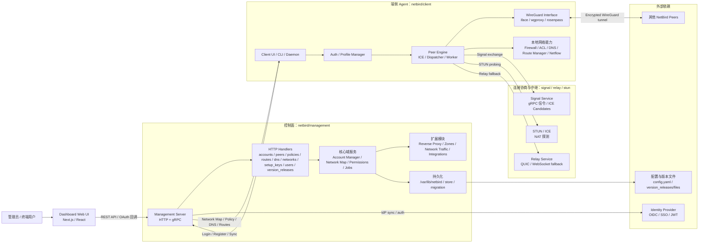

# Cloink / NetBird Architecture

核心链路：

- 管理入口：管理员通过 Dashboard 调用 Management HTTP API，覆盖账号、用户、组、策略、路由、DNS、网络资源、安装密钥、版本发布等管理功能。
- 控制分发：Management 维护账号状态、权限、Network Map、任务和持久化数据，并把网络配置同步给客户端。
- 端侧执行：Client Daemon 完成认证、拉取网络地图、配置 WireGuard、应用 ACL/防火墙/DNS/路由，并通过 ICE 建立点对点连接。
- 实时连接：Signal 只负责协商消息；STUN 帮助 NAT 探测；P2P 不可用时走 Relay；最终业务流量通过 WireGuard 加密隧道传输。
- 自托管部署：`netbird/main/docker-compose.yml` 当前把 Dashboard 暴露在 `8080`，把组合服务暴露在 `8081` 和 UDP `3478`，数据卷挂载到 `/var/lib/netbird`。
