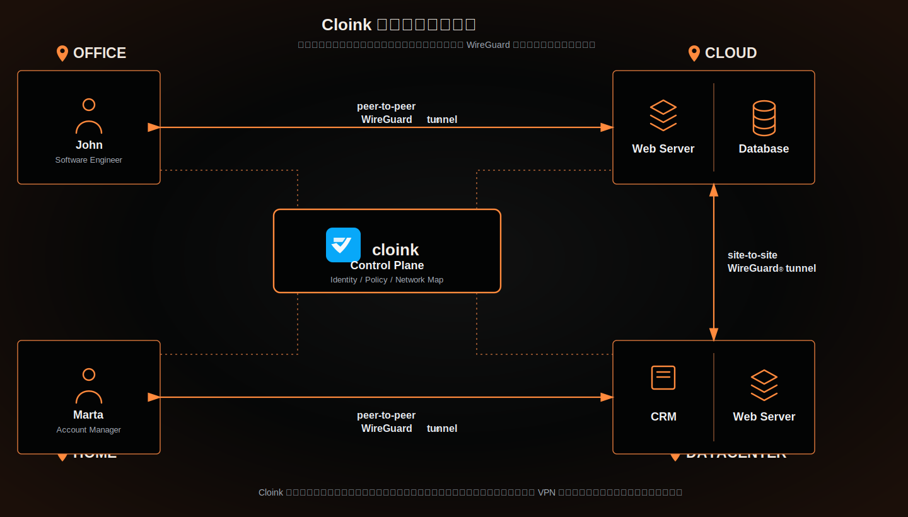

# Cloink 当前安全组网架构

这张图用于和传统 VPN 架构做对比。Cloink 将身份、策略、网络地图和设备配置集中到 Control Plane，用户和资源之间的数据流量通过 WireGuard 加密隧道直接通信。

主要特点：

- 用户、办公网络、家庭网络、云资源、数据中心资源统一接入 Cloink 控制面。
- Control Plane 负责身份认证、设备注册、策略下发、网络地图同步和连接协调。
- 业务流量不经过中心控制面转发，优先通过 peer-to-peer WireGuard 隧道直连。
- 云环境和数据中心之间可以通过 site-to-site WireGuard 隧道互联。
- 相比传统 VPN，减少 VPN Gateway、证书、IP 网段、NAT、路由、防火墙和安全组的重复配置。

汇报总结：

Cloink 的核心价值是把复杂的网络接入配置收敛到统一控制面，同时让真实业务流量保持端到端加密直连，从而降低运维复杂度，提高跨环境访问的安全性和可扩展性。
