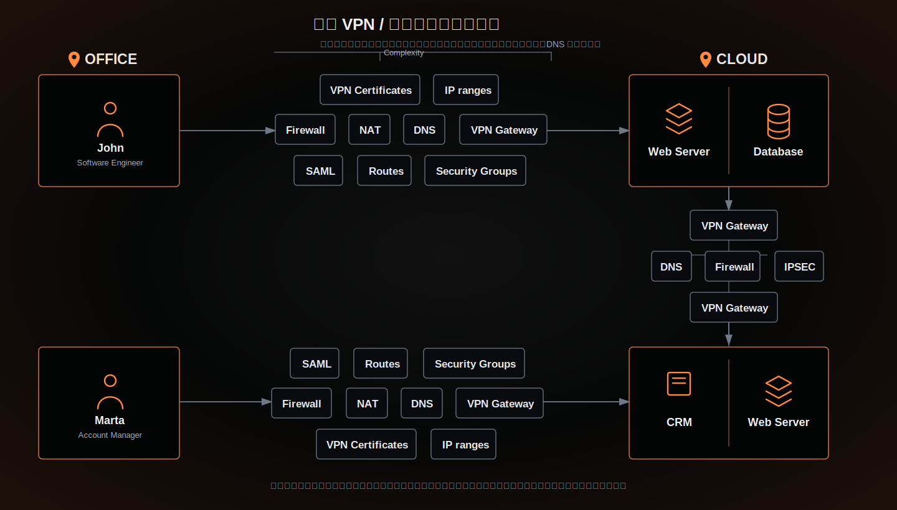

# 传统 VPN / 专线式远程访问架构

这张图用于和 Cloink / NetBird 架构做对比。传统方案通常以 VPN Gateway、IPSec、NAT、防火墙、DNS、路由、安全组、SAML、证书和 IP 网段为中心组织访问链路。

主要特点：

- 每个办公地点、家庭网络、云环境和数据中心都需要单独维护接入配置。
- 用户访问应用前，需要经过 VPN Gateway、防火墙、NAT、DNS、路由和安全组等多层网络控制。
- 云环境和数据中心之间也常需要额外的 VPN Gateway、IPSec、防火墙和 DNS 配置。
- VPN 证书、IP ranges、Routes、Security Groups 等配置分散在不同系统里，变更和排障成本高。
- 新增用户、新增应用、新增网络环境时，往往要重复配置网关、策略、证书和路由。

汇报总结：

传统架构的核心问题不是单个组件不可用，而是整体链路过长、配置重复、职责分散。随着用户、环境和应用数量增加，运维复杂度会快速上升。
